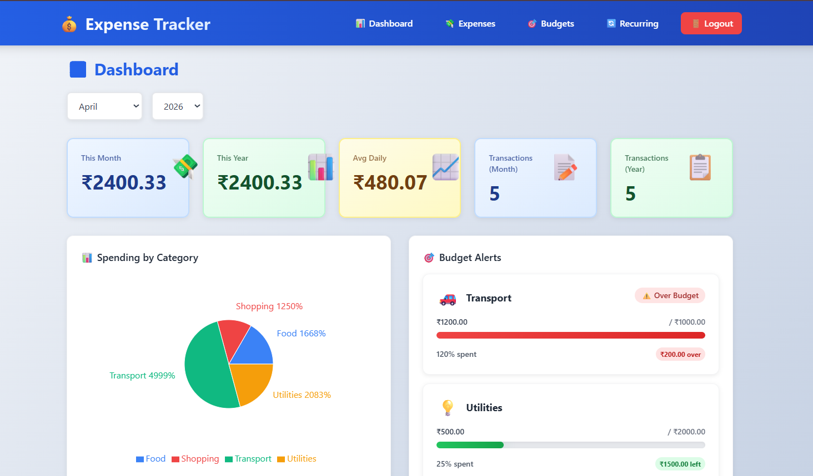
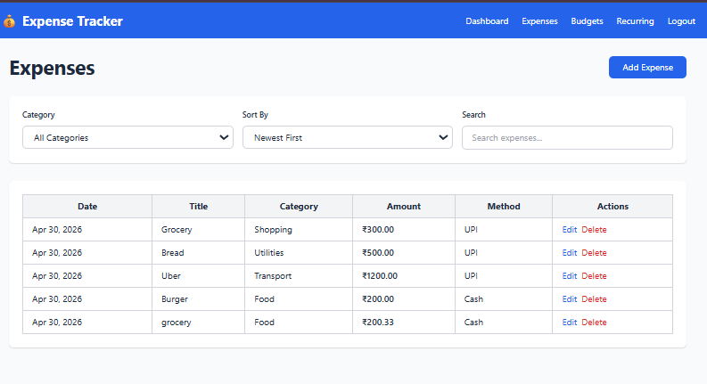
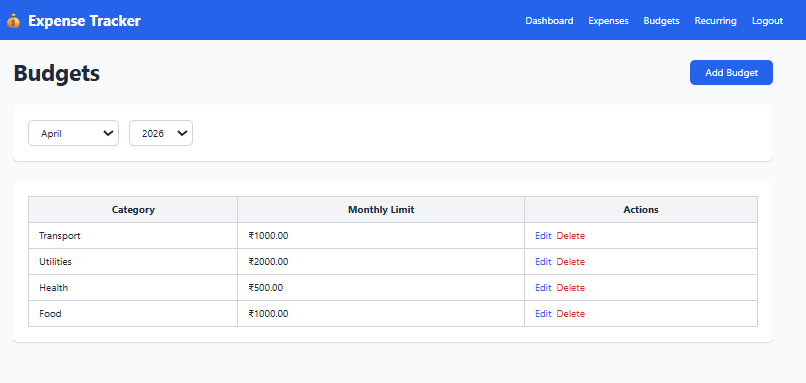
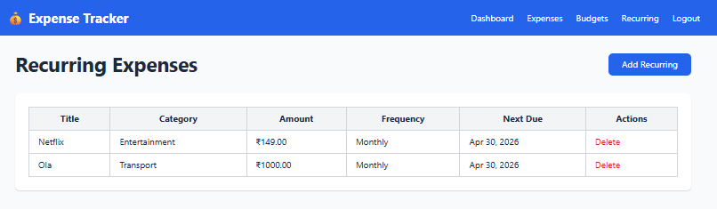
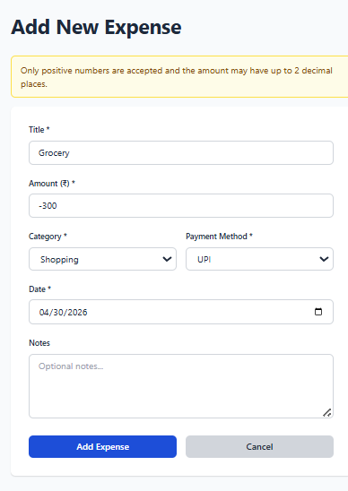

# 💰 Expense Tracker - Full Stack Application

A modern expense tracking app combining advanced backend engineering with a beautifully designed frontend. Features real-time analytics, JWT authentication, and production-grade security.

## ✨ Highlights

**Backend Excellence** 🏗️ | Advanced SQLAlchemy ORM, optimized queries, database indexing  
**Modern Frontend** 🎨 | Next.js 16 with TypeScript, Tailwind CSS, responsive design  
**Real-Time Analytics** 📊 | Interactive charts, category breakdowns, spending trends  
**Secure Auth** 🔐 | JWT tokens, bcrypt hashing, user-level data isolation  
**Deployed & Ready** 🚀 | Frontend on Vercel, Backend on Railway

---

## 🎯 Core Features

-  **Expense Management** - CRUD with filtering, search, pagination
-  **Budget Tracking** - Monthly budgets with visual alerts
-  **Recurring Expenses** - Auto-generate subscriptions (weekly/monthly/yearly)
-  **Analytics Dashboard** - Real-time insights, pie charts, spending trends
-  **Secure Auth** - JWT-based login/signup, bcrypt hashing
-  **Responsive UI** - Mobile, tablet, desktop optimized

---

## 📋 Tech Stack

**Frontend:** Next.js 16 • TypeScript • Tailwind CSS • Recharts • Axios • React Hook Form  
**Backend:** FastAPI • SQLAlchemy • PostgreSQL • Pydantic • JWT • Bcrypt  
**Deployment:** Vercel (Frontend) • Railway (Backend)

---

## � Screenshots

### Dashboard

*Real-time analytics with spending summary, budget alerts, and category breakdown pie chart*

### Expenses

*Manage transactions with filtering, sorting, and detailed expense entries*

### Budgets

*Set monthly budgets by category with visual progress tracking and alerts*

### Recurring Expenses

*Automated subscription management with flexible scheduling (weekly/monthly/yearly)*

### Advanced Features

*Support for adjustments and negative transactions for refunds and credits*

---

## �📋 Project Structure

```
expense-tracker/
├── backend/                 # FastAPI server
│   ├── main.py             # Entry point
│   ├── database.py         # SQLAlchemy setup
│   ├── models.py           # ORM models with relationships
│   ├── schemas.py          # Pydantic validation
│   ├── crud.py             # Database operations 
│   ├── auth.py             # JWT & password hashing
│   └── routes/             # API endpoints
│
├── frontend/               # Next.js frontend
│   ├── src/
│   │   ├── app/           # Pages (login, dashboard, etc.)
│   │   ├── components/    # Reusable components
│   │   ├── api/           # API client functions
│   │   ├── hooks/         # Custom React hooks
│   │   ├── types/         # TypeScript interfaces
│   │   └── lib/           # Utilities
│   ├── tailwind.config.ts # Design tokens
│   └── package.json
│
└── README.md
```

<<<<<<< HEAD
## 🚀 Quick Start

### Prerequisites
- Python 3.9+
- Node.js 18+
- npm or yarn

### Backend Setup

1. **Create Virtual Environment**
```bash
cd backend
python -m venv venv

# Windows
venv\Scripts\activate

# macOS/Linux
source venv/bin/activate
```

2. **Install Dependencies**
```bash
pip install -r requirements.txt
```

3. **Run the Server**
```bash
python -m uvicorn main:app --reload --host 0.0.0.0 --port 8000
```

Server runs at: `http://localhost:8000`  
API Docs: `http://localhost:8000/docs`

### Frontend Setup

1. **Install Dependencies**
```bash
cd frontend
npm install
```

2. **Run Development Server**
```bash
npm run dev
```

App runs at: `http://localhost:3000`

## 🗄️ Database Architecture

### Models Overview

#### User Model
```python
- id (PK)
- email (UNIQUE, indexed)
- hashed_password (bcrypt)
- created_at
- Relationships: expenses[], budgets[], recurring_expenses[]
```

#### Expense Model
```python
- id (PK)
- user_id (FK → users.id, indexed)
- title, amount, category, payment_method
- notes, expense_date, created_at
- Composite indexes:
  - (user_id, expense_date) - for date-range queries
  - (user_id, category) - for category filtering
  - (user_id, amount) - for amount filtering
```

#### Budget Model
```python
- id (PK)
- user_id (FK)
- category, monthly_limit
- month, year
- Unique constraint: (user_id, category, month, year)
```

#### RecurringExpense Model
```python
- id (PK)
- user_id (FK)
- title, amount, category
- frequency (ENUM: weekly/monthly/yearly)
- next_due_date, is_active
- Index: (user_id, is_active)
```

## 📊 API Endpoints

### Authentication
```
POST   /auth/signup         - Register new user
POST   /auth/login          - Login (returns JWT token)
```

### Expenses
```
POST   /expenses            - Create expense
GET    /expenses            - List with filters/sorting
GET    /expenses/{id}       - Get single expense
PUT    /expenses/{id}       - Update expense
DELETE /expenses/{id}       - Delete expense

Query parameters:
  ?category=Food
  ?sort_by=newest|oldest|highest|lowest
  ?from_date=2026-01-01
  ?to_date=2026-01-31
  ?min_amount=100
  ?max_amount=1000
  ?search=grocery
  ?skip=0&limit=20
```

### Dashboard (Analytics)
```
GET    /dashboard           - Complete dashboard (all below)
GET    /dashboard/summary   - Monthly/yearly totals, avg spend
GET    /dashboard/category-breakdown  - Spending by category
GET    /dashboard/budget-alerts       - Budget status
GET    /dashboard/recent-transactions - Last 5 expenses
```

### Budgets
```
POST   /budgets            - Create budget
GET    /budgets            - List budgets (query: ?year=2026&month=1)
PUT    /budgets/{id}       - Update budget limit
DELETE /budgets/{id}       - Delete budget
```

### Recurring Expenses
```
POST   /recurring-expenses  - Create recurring expense
GET    /recurring-expenses  - List all active
PUT    /recurring-expenses/{id} - Update
DELETE /recurring-expenses/{id} - Deactivate
```

## 🔐 Security Features

✅ **JWT Authentication** - Secure token-based auth  
✅ **Bcrypt Password Hashing** - Industry-standard hashing  
✅ **User-Level Data Isolation** - Each user only accesses their data  
✅ **Foreign Key Constraints** - Prevent orphaned records  
✅ **CORS Configuration** - Restricted to frontend origin  
✅ **Input Validation** - Pydantic schemas  

## 📈 Advanced Database Features Implemented

### 1. Complex Queries with Aggregations
```python
# Category breakdown with sums and counts
SELECT category, SUM(amount), COUNT(*) 
FROM expenses 
WHERE user_id = ? AND YEAR(expense_date) = ? AND MONTH(expense_date) = ?
GROUP BY category

# Top spending category
SELECT category, SUM(amount)
FROM expenses
WHERE user_id = ?
GROUP BY category
ORDER BY SUM(amount) DESC
LIMIT 1

# Average daily spend
SELECT AVG(amount)
FROM expenses
WHERE user_id = ? AND YEAR(expense_date) = ? AND MONTH(expense_date) = ?
```

### 2. Efficient Filtering & Pagination
- Date range filtering
- Category-based filtering
- Amount range filtering
- Full-text search in title/notes
- Sorting by multiple criteria
- Offset-limit pagination

### 3. Budget Alerts Logic
- Compare actual spending vs budget limits
- Calculate percentage spent
- Flag over-budget categories

### 4. Recurring Expense Processing
- Auto-create expense entries on due date
- Update next_due_date based on frequency
- Support for weekly, monthly, yearly frequencies

### 5. Optimized Indexes
```sql
CREATE INDEX idx_user_expense_date ON expenses(user_id, expense_date);
CREATE INDEX idx_user_category ON expenses(user_id, category);
CREATE INDEX idx_user_amount ON expenses(user_id, amount);
CREATE INDEX idx_user_budget_month ON budgets(user_id, month, year);
CREATE INDEX idx_user_active_recurring ON recurring_expenses(user_id, is_active);
```

## 🎨 Frontend Architecture

### Pages
- **Home** - Landing page with login/signup links
- **Login/Signup** - Authentication pages
- **Dashboard** - Analytics, stats, recent transactions
- **Expenses** - Table with filtering, sorting, search
- **Budgets** - Monthly budget management
- **Recurring** - Subscription tracking

### Components
- `Navigation` - Top navigation bar
- `ExpensesTable` - Data table with pagination
- `BudgetCard` - Budget progress card
- `CategoryChart` - Pie chart using Recharts
- `StatCard` - Dashboard stat cards
- `ErrorAlert` - Error message display
- `LoadingSpinner` - Loading indicator

### State Management
- Custom hooks: `useAuth()`, `useExpenses()`, `useDashboard()`
- API client with interceptors
- Local storage for auth token

## 🧪 Testing the Application

### 1. Create User
```bash
POST /auth/signup
{
  "email": "user@example.com",
  "password": "password123"
}
```

### 2. Add Expenses
```bash
POST /expenses
{
  "title": "Grocery Shopping",
  "amount": 500,
  "category": "Food",
  "payment_method": "Card",
  "expense_date": "2026-01-15T10:30:00"
}
```

### 3. Filter Expenses
```bash
GET /expenses?category=Food&sort_by=highest&from_date=2026-01-01&to_date=2026-01-31
```

### 4. View Dashboard
```bash
GET /dashboard?year=2026&month=1
```

## 📦 Dependencies

### Backend
- **fastapi** - Web framework
- **sqlalchemy** - ORM
- **pydantic** - Validation
- **python-jose** - JWT
- **passlib + bcrypt** - Password hashing
- **uvicorn** - Server

### Frontend
- **next.js** - React framework
- **typescript** - Type safety
- **tailwindcss** - Styling
- **axios** - HTTP client
- **recharts** - Charts
- **react-hook-form** - Forms

## 📝 Notes

- Database file: `expense_tracker.db` (SQLite)
- JWT Secret: Change in production (`backend/auth.py`)
- CORS: Configure for production domain
- Token expires after 30 days
- All timestamps in UTC

## 🛠️ Development Tips

### Database Inspection
```bash
# View all tables
sqlite3 expense_tracker.db ".tables"

# View schema
sqlite3 expense_tracker.db ".schema"

# Query data
sqlite3 expense_tracker.db "SELECT * FROM users;"
```

### API Documentation
Auto-generated Swagger UI available at: `http://localhost:8000/docs`

### Enable SQL Logging
In `database.py`, set `echo=True` in engine creation to see all SQL queries.

## 🚀 Production Deployment

### Backend
- Use production ASGI server (Gunicorn + Uvicorn)
- Set `SECRET_KEY` from environment
- Use PostgreSQL instead of SQLite
- Enable HTTPS/SSL
- Set appropriate CORS origins

### Frontend
- Run `npm run build`
- Deploy static files to CDN
- Configure API base URL for production

## 📄 License

Built as an assessment project demonstrating production-grade full-stack development.
=======
---

## 🏗️ Architecture

```
┌─────────────────────────────────────────┐
│  Frontend (Vercel)                      │
│  Next.js • TypeScript • Tailwind CSS    │
└────────────────────┬────────────────────┘
                     │ Axios + JWT
┌────────────────────▼────────────────────┐
│  Backend (Railway)                      │
│  FastAPI • SQLAlchemy • PostgreSQL      │
└────────────────────┬────────────────────┘
                     │ SQL
┌────────────────────▼────────────────────┐
│  Database (PostgreSQL)                  │
│  Indexed tables • Relationships         │
└─────────────────────────────────────────┘
```
>>>>>>> b89d5b8 (docs: update README with project overview and screenshots)

---

## 🗄️ Database Schema

```
USERS (1:N)
├── EXPENSES (amount, category, date)
├── BUDGETS (monthly_limit, month, year)
└── RECURRING_EXPENSES (frequency, amount)

Indexes: (user_id, date), (user_id, category)
```

---

## 🔐 Security

-  **JWT Authentication** - Stateless tokens with expiration
-  **Bcrypt Hashing** - Industry-standard password security
-  **User Isolation** - Each user only sees their data
-  **Input Validation** - Pydantic schemas on all endpoints
-  **SQL Injection Prevention** - Parameterized queries via ORM
-  **CORS** - Restricted to frontend origin

---

## 🎓 Learning Outcomes

-  Full-stack TypeScript/Python development
-  Database design with relationships & constraints
-  JWT authentication & security best practices
-  RESTful API design
-  React hooks & state management
-  Real-time data visualization
-  Production deployment
-  Error handling & validation

---

## 📄 Documentation

- [QUICK_START.md](./QUICK_START.md) - Setup guide
- [DATABASE_ARCHITECTURE.md](./DATABASE_ARCHITECTURE.md) - Schema details
- [DATABASE_FEATURES.md](./DATABASE_FEATURES.md) - Advanced concepts
- [ASSESSMENT_VERIFICATION.md](./ASSESSMENT_VERIFICATION.md) - Features

---

**Built with ❤️ for production-grade full-stack development**
